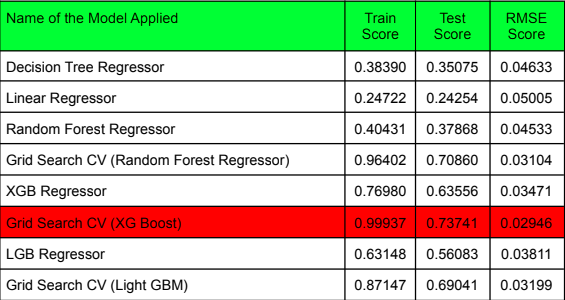
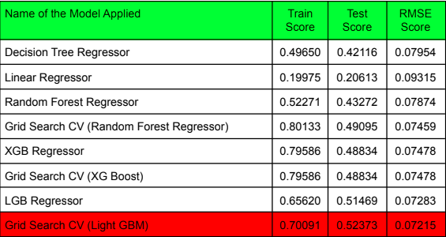

# Traffic Prediction

## Problem Statement

Traffic prediction means forecasting the volume and
density of traffic flow, usually for the purpose of managing vehicle movement, reducing congestion, and generating the optimal (least time or energy-consuming) route. The task of detecting traffic for the next day, week etc.

## Dataset

The dataset contains 4 components (DateTime, Junction, Vehicles, id)
across 48120 rows. The DateTime column shows the timestamp along with the respective date.

- **DateTime** - It shows the date and timestamp
- **Junction** - It tells the junction number for which vehicles are present
- **Vehicles** - It tells the number of vehicles
- **id** - It tells the id number of a timestamp

Link to the dataset: [traffic.csv](https://github.com/ayushabrol13/Traffic-Prediction---PRML-Course-Project/blob/master/traffic.csv)

## Implemented the following algorithms

- **Decision Tree Regressor**
  Decision tree builds regression or classification models in
  the form of a tree structure. It breaks down a dataset into smaller and smaller subsets
  while at the same time an associated decision tree is incrementally developed. The final
  result is a tree with decision nodes and leaf nodes.
- **Linear Regression**
  Linear regression performs the task to predict a dependent
  variable value (y) based on a given independent variable (x). So, this regression
  technique finds out a linear relationship between x (input) and y(output)
- **Random Forest Regressor**
  A Random Forest is an ensemble technique capable of
  performing both regression and classification tasks with the use of multiple decision
  trees and a technique called Bootstrap and Aggregation, commonly known as bagging.
  The basic idea behind this is to combine multiple decision trees in determining the final
  output rather than relying on individual decision trees.
- **XGBoost Regressor**
  Extreme Gradient Boosting, or XGBoost for short, is an ef icient
  ensemble learning algorithm via gradient boosting. It provides a parallel implementation of decision trees that are created in a sequential form, where weights play an important role.
- **LightGBM Regressor**
  Light GBM is a gradient boosting framework that uses
  tree-based learning algorithms. Light GBM grows trees vertically while other algorithms grow trees horizontally meaning that Light GBM grows trees leaf-wise while other algorithms grow level-wise. It will choose the leaf with max delta loss to grow. When growing the same leaf, a Leaf-wise algorithm can reduce more loss than a level-wise algorithm.
- **GridSearchCV for Hyperparameter Tuning**
  For tuning the hyperparameters, We have used Grid Search CV, which uses a different combination of all the specified hyperparameters and their values and calculates the performance for each combination and selects the best value for the hyperparameters.

## Traffic Flow across different junctions according to time-period

## Correlation Heatmap

## Yearwise Count

## Traffic Flow Pairplots

## Model Evaluation

- **Junction 1**
  

- **Junction 2**
  

- **Junction 3**
  

- **Junction 4**
  

## Web Application and Pipeline Deployment

We implemented an end-to-end pipeline using the python pickle library. The four best models
for four different junctions were saved along with the preprocessing done on the data using the
pickle library and the four “.pkl” model files were created.

Then, we converted our directory into a pipenv environment and installed all the necessary
libraries.
We created a python file where we used the Python StreamLit library to render our website
server which included a home page (predictions page) which takes the input features from the
user in the form of radio buttons. Features input by the user:

- Year
- Month
- Date
- Hour
- Junction

We import all the four saved models in our py file and select which model to apply according to
the Junction information provided by the user and finally return the rounded off predictions
(Number of Vehicles) to the user.
## Contributors

[Ayush Abrol](https://github.com/ayushabrol13)

[Aryan Tiwari](https://github.com/AryanTiwarii)

[Neehal Prakash Bajaj ]()
